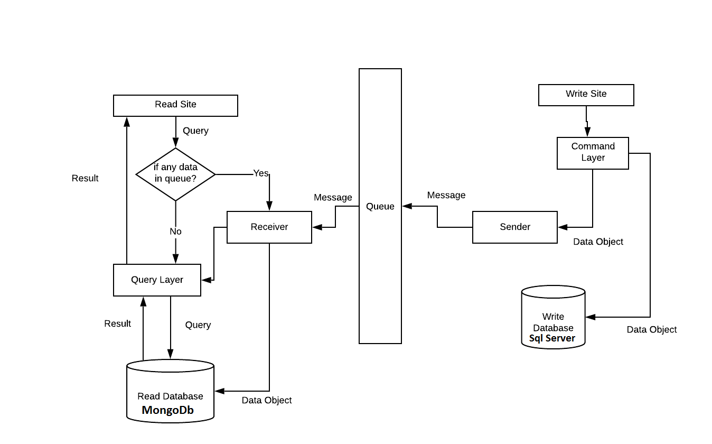
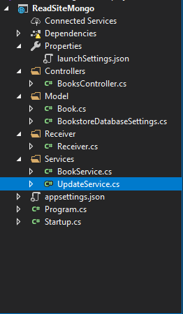
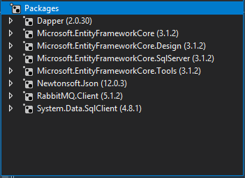

# Implementation of CQRS Pattern (using SQLServer ,MongoDB) in ASP.Net Web Application

[CQRS Introduction](https://github.com/mahedee/Articles/blob/master/microservices/implementation-of-cqrs-pattern-in-a-asp.net-web-application.md)

>For Read Database, MongoDb is used and for Write Database, SQl Server is used.

## Design



## Step 1: Read Site
For Read Database, at fisrt learn [MongoDB Basic]() and Commands.

> ### Confiure MongoDB:
Prerequisite: [MongoDB](https://docs.mongodb.com/manual/tutorial/install-mongodb-on-windows/)

>create MongoDb database and collection manually

 run Mongodb from command prompt:
 ```cmd
mongo
 ```
 create a new database named "BooksDb" manually in MongoDB,paste the command in command promt:
 ```cmd
 use BooksDb
 ```
 
  A database named BooksDb is created. If the database does exist, its connection is opened for transactions.
 
 
 now create a new collection named "Bookss" for BookDb
 paste the command:
 ```cmd
 db.createCollection('Bookss')
 ```
 
 The following result is displayed:
 ```cmd
 { "ok" : 1 }
 ```
 now insert some data manually in  Bookss collection:
 paste the command:

 ```cmd
db.Bookss.insertMany([{'Name':'Design Patterns','Price':54.93,'Category':'Computers','Author':'Ralph Johnson'}, {'Name':'Clean Code','Price':43.15,'Category':'Computers','Author':'Robert C. Martin'}])

 ```
  The following result is displayed:
 ```cmd
 {
  "acknowledged" : true,
  "insertedIds" : [
    ObjectId("5bfd996f7b8e48dc15ff215d"),
    ObjectId("5bfd996f7b8e48dc15ff215e")
  ]
}
 e```
 
 > Create an ASP.Net Api project for ReadSite
  
 name that project "ReadSiteMongo".

 


now create a new folder for all model class named "Model" .in Model folder create a model class named "Book.cs".

Paste the following Code in "Book.cs":

```c#

using MongoDB.Bson;
using MongoDB.Bson.Serialization.Attributes;
using Newtonsoft.Json;
namespace ReadSiteMongo.Model
{

    public class Book
    {

        [BsonId]
        [BsonRepresentation(BsonType.ObjectId)]
        public string Id { get; set; }

        [BsonElement("Name")]
        [JsonProperty("Name")]
        public string BookName { get; set; }

        public string Price { get; set; }

        public string Category { get; set; }

        public string Author { get; set; }
    }
}

```
In Model folder, again create a model class for connecting MongoDb Database and collection, named "BookstoreDatabaseSettings.cs".


Paste the following Code in "BookstoreDatabaseSettings.cs":
```c#


namespace ReadSiteMongo.Model
{
  
        public class BookstoreDatabaseSettings : IBookstoreDatabaseSettings
        {
            public string BooksCollectionName { get; set; }
            public string ConnectionString { get; set; }
            public string DatabaseName { get; set; }
        }

        public interface IBookstoreDatabaseSettings
        {
            string BooksCollectionName { get; set; }
            string ConnectionString { get; set; }
            string DatabaseName { get; set; }
        }
    

}

```
 For Conecting Database connection Settings, 
 Edit "appsettings.json" file with the following code :

 ```c#

 "BookstoreDatabaseSettings": {
    "BooksCollectionName": "Bookss",
    "ConnectionString": "mongodb://localhost:27017",
    "DatabaseName": "BooksDB"
  }

  ```

  For receiving message from RabbitMQ, create a new folder named "Receiver".In Receiver folder ,create a new class named "Reciver.cs".
   Paste the following Code in "Receiver.cs":
   ```c#

using RabbitMQ.Client;
using System;
using System.Text;
using RabbitMQ.Client.Events;
using Newtonsoft.Json;
using System.Collections.Generic;
using ReadSiteMongo.Model;

class Receiver
{

    public static List<Book> ReceiveEvent()
    {

        List<Book> books = new List<Book>();
        var factory = new ConnectionFactory() { HostName = "localhost" };
        using (var connection = factory.CreateConnection())
        using (var channel = connection.CreateModel())
        {
          

            channel.ExchangeDeclare("bookExchange", ExchangeType.Direct);
            channel.QueueDeclare("book", false, false, false, null);
            channel.QueueBind("book", "bookExchange", "", null);

            bool noAck = true;
            var response = channel.QueueDeclarePassive("book");
            for (int i = 0; i < response.MessageCount; i++)
            {
                BasicGetResult result = channel.BasicGet("book", noAck);
                if (result != null)
                {
                    var body = result.Body;
                    var message = Encoding.UTF8.GetString(body);
                    var book = JsonConvert.DeserializeObject<Book>(message);
                    books.Add(book);
                }
            }
            return books;
        }
    }
}


```
Create a new folder named "Services".in Services folder create a new class named "UpdateService.cs".

Paste the following code in "UpdateService.cs":
```c#
using ReadSiteMongo.Model;
using MongoDB.Driver;
using System.Collections.Generic;
using System.Linq;


namespace ReadSiteMongo.Services
{
    public class UpdateService
    {
        private readonly IMongoCollection<Book> _books;

        public UpdateService(IBookstoreDatabaseSettings settings)
        {
            var client = new MongoClient(settings.ConnectionString);
            var database = client.GetDatabase(settings.DatabaseName);

            _books = database.GetCollection<Book>(settings.BooksCollectionName);
        }
        public void Create(List<Book> books)
        {
            foreach (var book in books)
            {
                _books.InsertOne(book);
            }

        }

    }
}

```
Again in Service folder creete a class for query, named "BookService.cs".
Paste the following code in BookService.cs:   

```c#

using ReadSiteMongo.Model;
using MongoDB.Driver;
using System.Collections.Generic;
using System.Linq;

namespace ReadSiteMongo.Services
{
    public class BookService
    {
        private readonly IMongoCollection<Book> _books;

        public BookService(IBookstoreDatabaseSettings settings)
        {
            var client = new MongoClient(settings.ConnectionString);
            var database = client.GetDatabase(settings.DatabaseName);

            _books = database.GetCollection<Book>(settings.BooksCollectionName);
        }

        public List<Book> Get() =>
            _books.Find(book => true).ToList();

        
    }
}
```


Now in Controller class create a new contraoller class named "BooksController.cs".

Paste the following code in BooksController.cs :

```c#

using System;
using ReadSiteMongo.Services;
using Microsoft.AspNetCore.Mvc;
using System.Collections.Generic;
using System.Linq;
using System.Threading.Tasks;
using Microsoft.Extensions.Logging;


namespace ReadSiteMongo.Controllers
{
    [ApiController]
    [Route("[controller]")]
    public class BooksController : ControllerBase
    {
        private readonly BookService _bookService;
        private readonly UpdateService _updateEvent;

        public BooksController(BookService bookService, UpdateService updateEvent)
        {
            _bookService = bookService ?? throw new ArgumentNullException(nameof(bookService));
            _updateEvent = updateEvent ?? throw new ArgumentNullException(nameof(updateEvent));
        }

        [HttpGet]
        public ActionResult<List<Object>> Get()
        {
            var books = Receiver.ReceiveEvent();
            if (books.Count > 0)
            {
                _updateEvent.Create(books);
            }
            return Ok( _bookService.Get());
            
        }

     
    
    }
}
```


Now edit StartUp.cs class with the following Code:

```C#
 public void ConfigureServices(IServiceCollection services)
        {
          

            services.Configure<BookstoreDatabaseSettings>(
       Configuration.GetSection(nameof(BookstoreDatabaseSettings)));

            services.AddSingleton<IBookstoreDatabaseSettings>(sp =>
                sp.GetRequiredService<IOptions<BookstoreDatabaseSettings>>().Value);
            

            services.AddSingleton<BookService>();
            services.AddSingleton<UpdateService>();

            services.AddControllers();

           
        }
```


>List of packages for ReadSiteMongo:


## Part 2: Write Site

First of all create an ASP.Net Core Api project for write name that project "WriteSiteSQL". SqlServer is used for write database
  


Now create a new folder for Model class, name that folder "Model",in Model folder create a new model class named "Book.cs".

Paste the following code in Book.cs class:
```C#
using System;
using System.Collections.Generic;
using System.Linq;
using System.Threading.Tasks;
using System.ComponentModel.DataAnnotations;

namespace WriteSiteSQL.Model
{
    public class Book
    { 
        
           [Key]
           public int Id { get; set; }
            public string BookName { get; set; }

            public string Price { get; set; }

            public string Category { get; set; }

            public string Author { get; set; }
        }
    }


```
Again create another model class in Model folder and name that class "BookDto.cs".

Paste the following code in the BookDto.cs class:
 ```C#

namespace WriteSiteSQL.Model
{

    public class BookDto
    {

    
        public string BookName { get; set; }

        public string Price { get; set; }

        public string Category { get; set; }

        public string Author { get; set; }
    }
}

 ```
 Now create a new folder, name it "Command".In Command folder create a database Context class, "CommandContext.cs".

Paste the following code in CommandContext.cs class:
```C#
using Microsoft.EntityFrameworkCore;
using WriteSiteSQL.Model;

namespace WriteSiteSQL.Command
{
 
    public class CommandContext : DbContext
    {
        public CommandContext(DbContextOptions<CommandContext> options) : base(options) { }
        public DbSet<Book> Books { get; set; }

    }
}

```
Open appsettings.json
Add the following code

```C#
  "ConnectionStrings": {
    "CommandContext": "Server=(localdb)\\MSSQLLocalDB;Database=BookCommandContext;Trusted_Connection=True;MultipleActiveResultSets=true"
  }
 }
```

Inside the Controller, create a controller class and name that class "WriteBooksController.cs".

Paste the folloowing code in  WriteBooksController.cs class:
```C#
using System;
using System.Collections.Generic;
using System.Linq;
using System.Threading.Tasks;
using Microsoft.AspNetCore.Mvc;
using WriteSiteSQL.Command;
using WriteSiteSQL.Model;

// For more information on enabling MVC for empty projects, visit https://go.microsoft.com/fwlink/?LinkID=397860

namespace WriteSiteSQL.Controllers
{
    [ApiController]
    [Route("[controller]")]
    public class WriteBooksController : ControllerBase
    {
        private readonly ICommandS _commands;
        public WriteBooksController(ICommandS commands)
        {

            _commands = commands ?? throw new ArgumentNullException(nameof(commands));


        }
        [HttpGet]
        public string massage()
        {
            return "add books via postman ";

        }

        [HttpPost]
        public void RegisterBook([FromBody] BookDto value)
        {

            _commands.RegisterBook(value.BookName, value.Price, value.Category ,value.Author);

        }
    }
}


```


In Command folder, create a interface class and name that class "ICommandS.cs".
Paste the following code in ICommandS.cs class.
```C#


using WriteSiteSQL.Model;

namespace WriteSiteSQL.Command
{
    public interface ICommandS
    {
        Book RegisterBook(string bookName, string price,string category,string author);

    }
}

```
For Implimenting interface class method, create a new class in Command folder and name that class "BookServices.cs".
Paste the following code in BookServices.cs class
```C#
using Newtonsoft.Json;
using RabbitMQ.Client;
using WriteSiteSQL.Model;

namespace WriteSiteSQL.Command
{
    public class BookServices : ICommandS
    {
        private readonly CommandContext _context1;
        public BookServices(CommandContext commandContext)
        {
            _context1 = commandContext;
        }

        public Book RegisterBook(string bookName, string price, string category, string author)
        {
            var newBook = new BookDto() { BookName = bookName, Price = price ,Category = category, Author = author  };
            var newBooks = new Book() { BookName = bookName, Price = price ,Category = category, Author = author  };
            var message = JsonConvert.SerializeObject(newBook);
            Sender.EventGenerator(message);

            _context1.Books.Add(newBooks);


            _context1.SaveChanges();

            return newBooks;
        }
    }
}

```
Here in RegisterBook() Method , the updated data is converted into message. Then the message  passes to  a Sender class.
```C#
 
            var message = JsonConvert.SerializeObject(newBook);
            Sender.EventGenerator(message);
            
    
```

now create a new class in a new foloder named "Sender" and name that class "Sender.cs".
```C#
using RabbitMQ.Client;
using System;
using System.Collections.Generic;
using System.Linq;
using System.Text;
using System.Threading.Tasks;

public class Sender
{
    public static void EventGenerator(string message)
    {

        var factory = new ConnectionFactory() { HostName = "localhost" };

        using (var connection = factory.CreateConnection())
        {
            using (var channel = connection.CreateModel())
            {

                var body = Encoding.UTF8.GetBytes(message);
                channel.ExchangeDeclare("bookExchange2", ExchangeType.Direct);
                channel.QueueDeclare("book", false, false, false, null);
                channel.QueueBind("book", "bookExchange", "", null);
                channel.BasicPublish("bookExchange", "", null, body);
            }
        }


    }
}

```
 the Sender.cs class is responsible for sending message to the Queue (Rabbit.MQ) and Queue will send the message to the corresponding receiver.

 Back to the BookServices.cs class, after passing the message to a message broker, the Write Database will also be updated.
 ```C#
  _context1.Books.Add(newBooks);


            _context1.SaveChanges();

            return newBooks;
 ```

Open startup.cs class, Add the following code:
```C#
 public void ConfigureServices(IServiceCollection services)
        {
            services.AddControllers();
            services.AddScoped<ICommandS, BookServices>();
            services.AddDbContext<CommandContext>(option => option.UseSqlServer(Configuration.GetConnectionString("CommandContext")));

        }
```
For creating a database table based on Book.cs model class, adding Migration is needed. 

Open Nuget Package Manager ->Package Manager Console 
and Paste the command in PMC
```
Enable-Migrations
add-migration
CommandMigration
Update-Database
```

List of Packages for WriteSiteSql  is given below:



